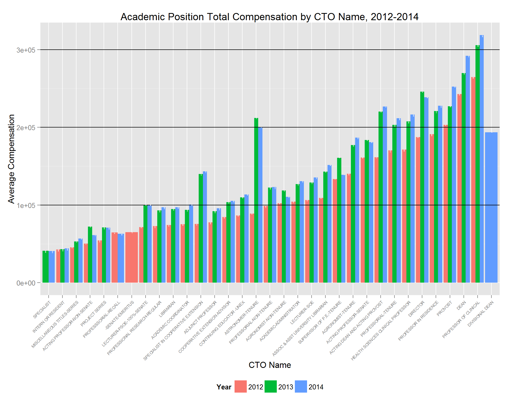
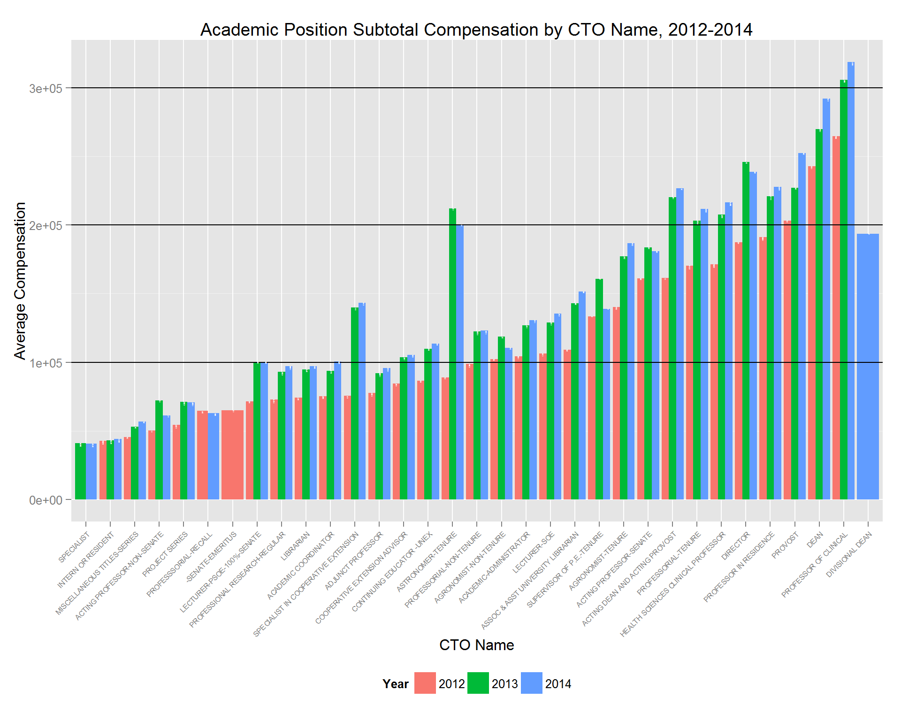
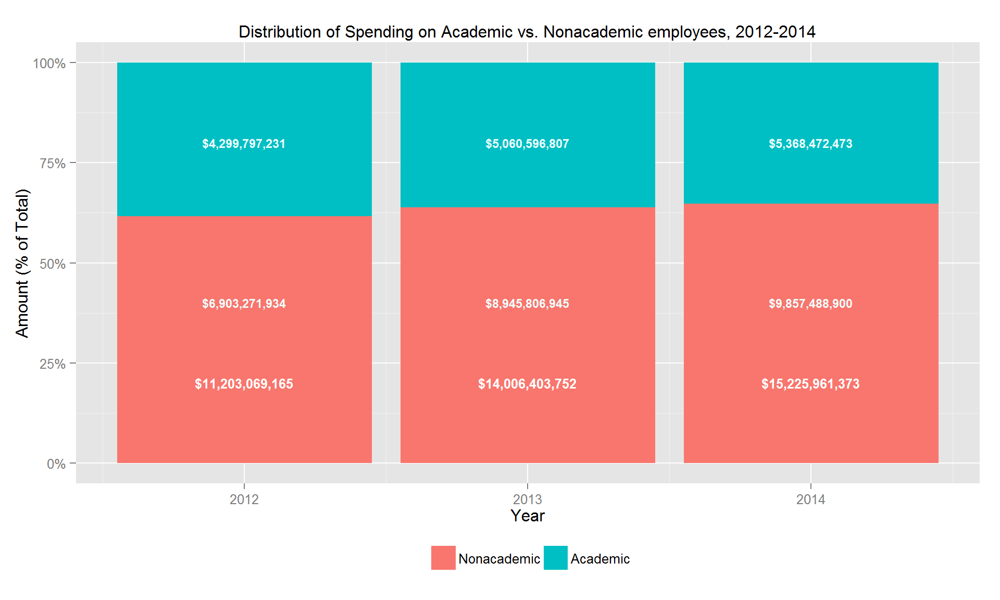
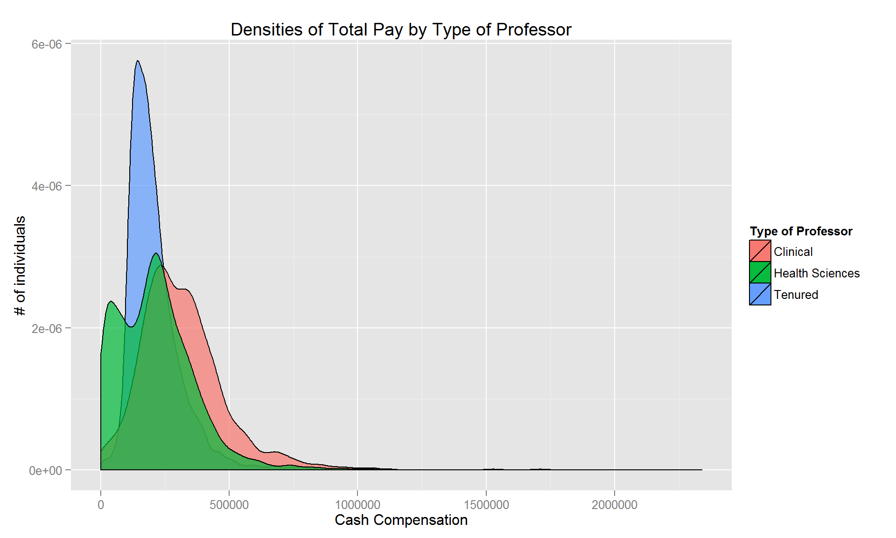
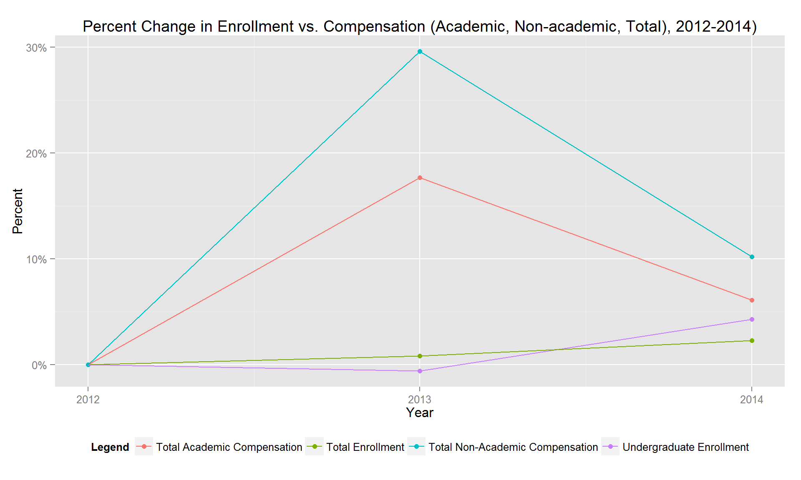

# Introduction
In 2014, the largest database of California government employee compensation was released: Transparent California. It is searchable by name and job titles on TransparentCalifornia.com and includes over 2 million salary records. Being University of California (UC) students, we will investigate UC employee compensation data. With tuition and student debt at all-time highs, university spending is under scrutiny. Since the delivery of education, research, and health care is labor intensive, payroll costs account for about half of the UC's annual operating budget. Thus, we thought it would be both interesting and important to analyze this data. 

## Description of Problems
Our main research question is: How has the University of California pay distribution changed over time? To answer this, we will answer these questions: What are the disparities between academic vs. non-academic pay over time? What does the distribution of pay look like among academic employees? How has total staff grown in relation to enrollment? How has total compensation changed in relation to enrollment?

## Description of Data
Our three primary raw data sources were from TransparentCalifornia.com for 2012, 2013, and 2014 UC compensation data. Each of the data sets had over 260,000 lines of information covering employee name, job title, base pay, overtime pay, total benefits, total pay, total pay with benefits, year, and agency. While the availability of this information online was intended to show "transparency and public accountability," the format of the data hindered analysis since it was incredibly inconsistent within and between years. To help navigate the title coding system, we used the UCOP Academic Title Code document. We also obtained student enrollment figures from the UC Annual Financial Report document. 

## Set-up
Set-up for this analysis was nontrivial due to the sheer amount of variation in the underlying dataset. For example, in one year, the employee names were capitalized, whereas in the others, they were not, and in another year, names were in the form of "fname lname" but in the other years they were in the form of "lname, fname." In one year's data, the titles contained full words - e.g. "PROFESSOR-HCOMP," while the other years used abbreviated title names, e.g. "PROF-HCOMP." Also, the raw data files were not properly encoded in some cases - the Title dataset, for example, had strange Unicode characters in a number of titles which we could not correct for in R itself. The Title dataset also had another major problem: in some cases, the words in the titles where separated by a space and/or a hyphen, with no consistency in style, but in the yearly compensation CSVs, the words were separated with different delimiters or number of delimiters, such as two (or more) spaces/hyphens instead of one, or spaces/hyphens switched in with respect to their locations in the Title dataset, and several other tedious problems like this. Cleaning the data was a major hassle and frustration. Data inconsistency handicapped the confidence with which we were able to make any analyses on the dataset at large.

With regards to cleaning, R's tools where unfortunately insufficient for our purposes. We had to resort to command like utilities (cut, sort, sed) and manual munging in a text editor (for cleaning up Unicode, figuring out the permutations of spaces and hyphens necessary to match all the cases we had the patience to find) in order to get a dataset that R (and our group) was happy with. Nonetheless, some of R's tools where far superior to any external ones, especially with respect to transforming CSVs - write.csv in particular.

----

# Initialization

We begin by loading the financial data we've cleaned. Apart from the discussion above, comments can be found in `code/clean_data.R` which should elucidate the process behind obtaining this clean data.

```r
uc2011 <- read_csv("../data/uc2011.csv")
uc2012 <- read_csv("../data/uc2012.csv")
uc2013 <- read_csv("../data/uc2013.csv")
uc2014 <- read_csv("../data/uc2014.csv")
```

Prior to finding the UC Titles dataset, we tried manually grouping the ~2900 unique titles in these datasets via 
regex. We set up a hash with associated titles in order to `sapply()` a regex across the list of titles to get them matched to groups.

Using this method, we eventually tagged about 91.5% of the ~250,000 employees in the dataset with a department. However, this method was problematic, as it did not lend itself well to separating employees that fell into multiple categories, such as assistant/associate/visiting/research professors, and still left us with a large number of departments to group further. The code to make this work was also difficult to maintain, so we abandoned this thread.

We then found and began cleaning the Title dataset by exporting a table from a PDF document provided by the UCOP website to Microsoft Excel and using Excel's CSV output tools to generate a initial, raw CSV datafile. We then read this data into R to begin exploratory analysis. This was hindered by text problems, so we first used `grep()` and regular expressions to try and manually correct individual problems in the CSV, but this was ugly and difficult to maintain. Our next step was to use dplyr to extract and sort the columns we wanted and used `write.csv()` to generate a second-stage CSV, which we then piped through a text editor, where we manually made necessary corrections and then used this final CSV as the basis for the rest of our analysis. 


```r
titles <- read.csv('../rawdata/academic-titles.csv', stringsAsFactors = FALSE)
titles <- titles[1:511, c(1, 4)]

titles$Title[grep('PROF OF CLIN- FY', titles$Title)] <- 'PROF OF CLIN-FY'
# more such regex replacements
# ....
# write interim. Some text problems from the pdf->txt process still have to be fixed by hand.
write.csv(titles, '../data/academic-titles.csv')
# after making manual corrections where necessary, we now reload the data:
titles <- read.csv('../data/academic-titles.csv')
```

Using the titles dataset was an improvement over our previous attempt, in that it gave us an easy way to separate academic from staff/non-academic titles, but it was not as granular as our manual, regular-expressions based method. Nonetheless, the titles version was the schema we used for our analysis. The original method is preserved in `department_regexes.R` in the `code/` subdirectory.

We are defining the classification as follows:

* _Academic employees_: those directly engaged in the academic mission - professors, clinical professors, other 
teaching faculty, researchers, and other academic titles
* _Staff/non-academic employees_: those who support academic departments, student services, patient care and other university functions

----

# Analysis Approach and Findings

## Average total compensation for academic positions, 2012-2014




Our first thought was to see what the distribution of pay for academic employees looked like. The lines are located at $100k intervals. We can see some interesting things in this graph - it seems that many departments received a substantial (enormous, in some cases) raise from 2012 to 2014. However, this conflicts with reports released by the UCOP that suggest that on average, UC employees have gone raise-less for several years. Perhaps this reflects an increase in non-cash/benefits compensation, such as a new health plan?

## Average Base Compensation for Academic Positions, 2012-2014
If we only take base cash compensation (i.e. total minus estimated cash value of benefits), the graph looks like this:




They are almost identical. It seems cash compensation did indeed increase fairly substantially - the data shows that, in 2013 at least, most academic positions in the UC system received a pretty good raise.

To better understand the composition of academic employee compensation, we took a closer look at the Average Total Comp for Academic Position bar chart shows the distribution of average compensation by position, how many employees are in each segment (noted in the bars), and change over time over three years. Analyzing the 2012 bars, using the marked $100k increments, we see that the majority of positions (14,058 employees) earn <$100k, followed by positions (12,919 employees) that earn $100k-200k, and positions (1,140 employees) that earn >$200k. Only two positions earned >$200k: deans and clinical professors. Comparing this finding to the 2013 and 2014 colored bars, we see a change. For example, tenured astronomers, who had been earning an average of close to $150k in 2012, were earning on average $200k by 2014. That’s an over 35% jump. The same increase in compensation could be seen across the board. Whereas there was not even a >$300 category in 2012, the category was created by clinical professors in 2014, and other positions appear on track to joining the ranks in the foreseeable future. While we see compensation increases, it is also worthy to note the <$100k segment has been growing in headcount, by 50.6% from 2012-2014. Thus there are more people in lower-paying positions.

## % Distribution of Spending on Academic vs Non-Academic Employees, 2012-2014
After that, what about the distribution of academic vs. nonacademic spending? The UC's annual operating budget is substantial, and payroll alone was **$10,574,432,464** in 2011, **$11,203,069,165** in 2012, **$14,006,403,752** in 2013, and **$15,225,961,373** in 2014, respectively.




To visualize the change in academic and non-academic workforce distribution of total compensation over time, we created a stacked bar chart. The chart shows that relative to non-academic employee compensation, spending on academic employees has been declining from 38.38% to 36.13% to 35.26% of total compensation spending over the last three years. 

## $ Distribution of Spending on Academic vs Non-Academic Employees, 2012-2014


This bar chart represents the same information as the previous one, but in absolute $ terms. It shows total compensation spending has been increasing, by 25.02% from 2012-2013 and 8.71% from 2013-2014. Both academic and non-academic employee compensation have been rising, however non-academic employee compensation has done so at a higher rate (29.59% non-academic vs 18% academic from 2012-2013, 10.19% vs 6% from 2013-2014). This explains why we saw the decreasing trend in spending on academic employees compared to non-academic employees from year to year.

## Density Curve of Pay Within Professorial Titles (2014)
### (Tenured Professors, Clinical Professors, and Health Sciences Professors)


In this density chart, we explore the 2014 compensation of three types of professors: clinical professors, health sciences clinical professors, and tenured non-clinical professors. We expected clinical and health sciences clinical professors to have the highest compensation. This is from descriptive statistics of the data as well as the UC report that emphasized that health care centers bring the most money to the UC to justify higher compensation for employees related to that function. Thus, we expected overlapping, left skewed graphs. We hypothesized we would see a normal curve for tenured non-clinical professors. The chart was not as clear-cut as we thought it would be. Clinical and health services clinical professors do follow similar distributions, but are right skewed. The distributions confirm that some are making enormous amounts (as seem by the long right tail), but also reveals that not all of them are paid that much. The curve for clinical professors compensation is shifted rightwards of the bimodal curve for health sciences clinical professors compensation. Many health sciences clinical professors actually are paid less than nearly all tenured professors. This graph does confirm our hypothesis that tenured professors compensation follows a fairly normal distribution. There is a very thin right tail, which is understandable given the need to retain and fairly compensate celebrity professors. 

## Workforce Headcount vs. UC Student Enrollment, 2012-2014


This chart shows the trend in % changes in workforce headcount vs student enrollment. We hypothesized that across student types, as enrollment increased, workforce headcount would also increase (and vice versa). We looked at undergraduate enrollment alone, as well as undergraduate and graduate enrollment combined. This is because the UC is a research university and its academic workforce includes not only teaching, but research too, which graduate students partake in and thus are important to account for. Between 2012 and 2013, there is a decline in undergraduate student enrollment, but both academic and non-academic headcount increase. In contrast, between 2013 and 2014, there is a steep increase in undergraduate student enrollment, but academic headcount growth slows and non-academic headcount speeds up. This was surprising, as we expected to see more parallel lines and these are intersecting. However, when we looked at student enrollment overall, we see that between 2012 and 2013, though undergraduate enrollment declines, graduate student enrollment is high enough to bring the overall student enrollment up.  This could explain why headcount has been rising. 

## Workforce Compensation vs. UC Student Enrollment, 2012-2014


Having looked at enrollment's relation to headcount, we wanted to look further and see whether compensation and enrollment were related using this graph. We expected total compensation paid to grow at the same rate as enrollment. Again, we see the steady enrollment growth, but this graph shows that compensation rose at much higher rates from 2012 to 2013. Since we previously saw that academic headcount grew the most from 2012 to 2013, we expected academic compensation to follow the growth trend. However, this graph shows that non-academic compensation actually grew the most in comparison to academic compensation and enrollment changes, not academic compensation. Non-academic compensation grew at a rate more than 15 times enrollment did. Academic compensation also outgrew enrollment. Then, from 2013-2014 when enrollment grew, both academic and non-academic compensation declined. 

# Conclusion
Many of our findings were different from what we had expected when we set out to do this project. We realize we have some limitations, such as only analyzing three years of data, so we cannot make conclusions based off these graphs alone. In addition, we found that official reports from the UC system and our analyses of the data they published are differing (sometimes substantially) and it could be a reflection of obfuscation on the part of the UC system. Nonetheless, we think these are interesting findings that could guide a larger scale study. 

**Other Resources:**

* Desrochers, D. M., & Kirshstein, R. J. (2014). Labor intensive or labor expensive? Changing staffing and compensation     patterns in higher education (Issue Brief). Washington, DC: American Institutes for Research.
* UCOP Academic Title Code document
* UC Annual Financial Report document

